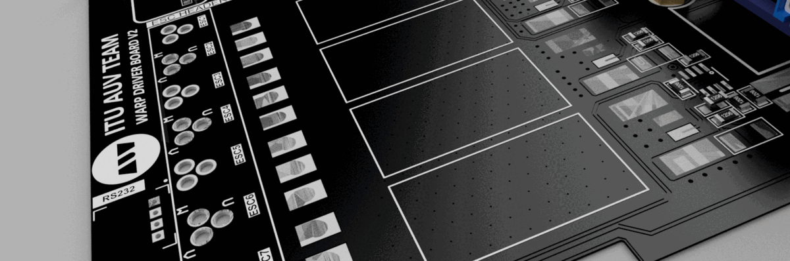

# WARP Driver Board Hardware 

WARP is the dedicated motor driver and power distribution board that powers our Autonomous Underwater Vehicle (AUV). This advanced board translates high-level navigation commands into precise motor controls, while simultaneously organizes an efficient and safe power distribution network. Its built-in monitoring system and safety features provide robust defenses against potential electrical failures, ensuring the AUV can withstand the challenging underwater environment.

<picture>    </picture>

This repository focuses Warp's hardware design. For more details on the firmware, visit the [Warp Firmware Repository](https://github.com/onur-ulusoy/auv-warp-firmware).

<picture>    </picture>

    

<em >AUV Electronics 2022</em>

<picture>    </picture>

    

<picture>    </picture>

    

<picture>    </picture>

## Table of Contents
- [WARP Driver Board Hardware](#warp-driver-board-hardware)
  - [Table of Contents](#table-of-contents)
  - [Board Description](#board-description)
  - [Electronics Design](#electronics-design)
    - [Layer Structure](#layer-structure)
    - [Primary Stage Protection](#primary-stage-protection)
    - [Secondary Stage Protection](#secondary-stage-protection)
    - [Microcontroller](#microcontroller)
    - [Power Distribution](#power-distribution)
    - [Connections and Monitoring](#connections-and-monitoring)
    - [Cooling and ESC Integration](#cooling-and-esc-integration)
  - [Mechanical Architecture](#mechanical-architecture)
  - [Manufacturing](#manufacturing)
  - [Technologies Used](#technologies-used)
  - [Project Timeline](#project-timeline)
  - [LICENSE](#license)

## Board Description

The Warp Driver Board manages the direction movements of the underwater vehicle. It controls the brushless AC motors, connected to the propellers known as Thrusters, with PWM signals via integrated circuits called ESCs, based on commands received from the vehicle's onboard computer NVDIA Jetson Xavier. The commands are transmitted from the computer to the main board, then to the driver board, with the conversion of the UART signal to RS232 signal in the form of protobuf encrypted data.

The secondary, but equally crucial, function of the Warp Driver Board is to manage power distribution. It stabilizes the 14-16 Volt input from the battery and provides steady 12V and 5V outputs to other electronic components, the onboard computer, and various peripherals. The Warp Driver Board also includes a secondary 5V regulator to control the voltage supplied to its onboard microcontroller. 

The board is designed with safety and efficiency in mind. It includes a 100A fuse at the battery input and can measure current/voltage in various areas using integrated ADCs, thereby shutting down the vehicle in case of danger. To accurately measure voltages, it utilizes shunt resistors and voltage dividers. Critical data about current, voltage, and temperatures at key points are displayed on an LCD screen. 

## Electronics Design

For a comprehensive understanding of the WARP Driver Board's intricate design and layout, you can always visit the [Schematic Sheets](/Schematic%20Sheets/). These detailed documents will provide you with valuable insights into the structure, connections, and functionalities of the board's various components.

<picture>    </picture>

### Layer Structure

The WARP Driver Board features a meticulously engineered 4-layer Printed Circuit Board (PCB) structure, designed using the advanced capabilities of Altium Designer. At the heart of the layout are the power and ground layers, smartly employed as inter-layers within the design.

These inter-layers serve more than just conducting electricity or acting as a return path. Their positioning within the inner layers of the board provides a close and uniform ground plane across the board, significantly reducing loop inductance for high-speed signals. This layout strategy inherently offers enhanced signal integrity and reduces the susceptibility of the board to electromagnetic interference (EMI), which could otherwise compromise the reliability and performance of the system.

Moreover, by sandwiching the power and ground planes between the outer signal layers, the PCB achieves a better thermal management. Heat generated by components mounted on the outer layers can be efficiently spread across the plane layers and dissipated, ensuring that the board components always remain within safe operating temperatures. This design is particularly critical in a demanding application environment such as an Autonomous Underwater Vehicle, where managing thermal behavior is crucial to maintain overall system reliability and longevity.

The 4-layer structure, thus, adds significant robustness to the WARP Driver Board, enabling it to effectively support complex and power-intensive operations while ensuring optimal performance and safety.

For a more detailed examination of the board layers and the overall PCB structure, you can visit the file [WARP.PcbDoc](/WARP.PcbDoc).

### Primary Stage Protection

The design of the WARP Driver Board integrates a 100A fuse at the start of the power distribution chain, serving as the primary line of defense against overcurrent situations. Overcurrent conditions, potentially caused by short circuits, overloads, or device failures, can result in significant damage to the electronics. The fuse, meticulously calibrated to handle the high power requirements of the Autonomous Underwater Vehicle, disconnects the power supply in an overcurrent event, safeguarding all downstream circuitry and components. This strategic integration of protection measures ensures the AUV's reliability and longevity, even under challenging underwater conditions.

<picture>    </picture>

### Secondary Stage Protection

In addition to the primary fuse protection, the WARP Driver Board also implements a secondary stage of protective measures through its comprehensive sensing system. Critical areas on the board are monitored using advanced instrumentation circuits paired with four Analog-to-Digital Converters (ADCs).

These ADC circuits continuously monitor important parameters such as the ESC and battery voltages, currents, and ESC temperatures. This information provides a real-time overview of the board's operation and the health of its critical components.

In the event that these monitored parameters deviate from their safe operating ranges - such as experiencing overcurrent, overheating, or abnormal voltage conditions - the microcontroller is immediately alerted. Based on the severity of the deviations, the microcontroller can take appropriate actions, including throttling back operations or, in extreme cases, halting operation entirely to prevent damage.

This two-tiered approach to protection, encompassing both hardware (fuse) and software (microcontroller and sensing system) measures, enhances the safety and reliability of the WARP Driver Board. It ensures that the board can withstand a broad range of operational scenarios while minimizing the risk of component damage and system failure.

<picture>    </picture>

### Microcontroller

The WARP Driver Board's heart is an STM32 development board, strategically mounted on the top layer. It utilizes a powerful Cortex series STM32F401 microcontroller, supplying the processing power required for managing the complex tasks associated with an Autonomous Underwater Vehicle.

The microcontroller's firmware is tailored specifically for the STM32F401, enhancing control over the hardware's functionality. It integrates the FreeRTOS, a real-time operating system, enabling efficient task scheduling and management. This feature ensures that critical operations like motor driving and power monitoring are handled both coherently and responsively, thereby boosting the system's overall reliability and performance. Because this is prototype version, we used dev. board. We think embedding the microcontroller chip on the board directly in the future versions of the board.

FreeRTOS prioritizes high-importance real-time tasks, such as motor control and power management, allowing them to be addressed immediately. Lower-priority tasks are also effectively managed without compromising system performance. The harmonious combination of this firmware and real-time operating system grants the WARP Driver Board the ability to execute its key tasks with the needed precision, efficiency, and reliability.

For a deeper understanding and more detailed information and source code on the firmware, feel free to visit the [Warp Firmware Repository](https://github.com/onur-ulusoy/auv-warp-firmware).

### Power Distribution

The WARP Driver Board is equipped with various power converters and connectors, facilitating an array of power distribution options. This arrangement allows the board to cater to the different voltage requirements of the onboard peripherals, effectively supporting the diverse electronic needs of the AUV.

<picture>    </picture>

### Connections and Monitoring
The WARP Driver Board is equipped with multiple communication protocols, facilitating an efficient exchange of information within the system. It communicates with the main board using a UART interface, ensuring a seamless and reliable data exchange.

Simultaneously, the board utilizes the I2C protocol for interfacing with the ADC circuits and the OLED display. The I2C communication allows for the real-time sensing and display of vital parameters like voltages, currents, and temperatures.

Moreover, to control the thrusters, the board generates PWM signals, offering precise control over the AUV's propulsion system. This control mechanism is vital for the agile and responsive movements of the AUV in the challenging underwater environment.

For direct on-board monitoring, the board supports an OLED mountable structure, providing real-time visual data of the system's key operational parameters. This feature, coupled with its capability to transmit critical data to the main board, ensures comprehensive system surveillance and robust control.

The versatility and efficiency in communication, along with robust monitoring mechanisms, underline the WARP Driver Board's exceptional capabilities. These features, combined with an emphasis on safety and precise control, make it ideal for managing the complex requirements of an Autonomous Underwater Vehicle.

    

### Cooling and ESC Integration
The WARP Driver Board uniquely integrates the Electronic Speed Controllers (ESCs) and optimizes their cooling. The ESC mount area, created with numerous vias (holes) and positioned in the coolest region of the PCB, ensures effective heat dissipation, keeping the ESCs within safe operational temperatures even during high-intensity activities.

Natural convection cooling is further enhanced during the AUV's navigation underwater, with the water flow around the ESC mount assisting in dispersing the heat. Moreover, this strategic placement allows easy access for maintenance, contributing to the system's overall reliability and lifespan.

The ESCs connect to the board through MT30-M connectors, linking them to the AUV's thrusters. They utilize BlueRobotics ESCs, specifically designed for challenging underwater conditions. This efficient design maintains ESC performance while ensuring longevity, demonstrating the board's focus on performance, durability, and maintainability.

Looking ahead, the design team is also considering the integration of a heat pipe for more advanced and efficient cooling. This future upgrade aims to further optimize the ESC's thermal management, ensuring peak performance even under heavy load conditions.

<picture>    </picture>

## Mechanical Architecture

The mechanical integration of the WARP Driver Board within the AUV has been executed with great attention to detail, ensuring stability and maximizing the use of available space. At every corner of the PCB, we've utilized standoffs and screws to secure the board to the stand, providing a sturdy and stable setup that resists vibration and shock.

Similar mounting structures have been employed for the power converters. They are secured to the PCB using standoffs and screws, maintaining their position securely even under the AUV's rigorous operating conditions.

In an innovative approach to space management, we have used pin headers to mount the ADC ICs and the microcontroller above the board. This structure elevates these components above the board, freeing up valuable space for additional SMD components.

We've also implemented a custom solution for ESC placement. The ESCs are secured with specially designed belts that are produced using 3D printing technology. This secure, custom fit ensures the ESCs stay in place while also facilitating optimal heat dissipation.

After all components are mounted, the stand is installed into the rear tube of the AUV. This process ensures the WARP Driver Board and its various components are well-protected and optimally positioned within the vehicle, demonstrating the seamless integration of mechanical and electronic design elements in the Autonomous Underwater Vehicle.

<picture>    </picture>

<picture>    </picture>

<picture>    </picture>

## Manufacturing 

The WARP Driver Board was designed with meticulous attention to manufacturing requirements and industry standards. We utilized the Design Rule Check (DRC) feature of Altium Designer to ensure our design adhered to the specific manufacturing specifications of our chosen PCB manufacturer, JLC PCB. You can view the details of this rule check [here](https://onur-ulusoy.github.io/auv-warp-driver-board/Output%20Files/Design%20Rule%20Check%20-%20WARP.html).

All necessary Gerber files, which provide the detailed manufacturing information required to translate our design into a physical board, are available in the [Output](/Output%20Files/) directory. 

We have manufactured and prototyped two versions of the WARP Driver Board with JLC PCB, using the feedback and insights gained from each iteration to continuously refine the design and functionality.

The final products, the manufactured boards, are currently installed on our Autonomous Underwater Vehicle and can be viewed at ITU Bisiklet Evi. This gives interested parties a chance to see our work firsthand and appreciate the tangible representation of our intricate electronics design.

## Technologies Used

## Project Timeline
This project is a proud contribution of the 2022 Electronics Team of the ITU AUV (Istanbul Technical University's Autonomous Underwater Vehicle) Team. Performed in the intervals Dec 2021 - Aug 2022.

Süeda Korkmaz and Onur Ulusoy, members of the team, meticulously carried out the comprehensive design and production of PCBs and circuits using Altium Designer. Two distinct versions were manufactured with the cooperation of JLCPCB. The team also prepared and ordered all electronic components required, and undertook the detailed process of typesetting.

The PCB has found its home at the ITU Bisiklet Evi, in the AUV section of the atelier, where it has been installed on the vehicle.

We extend our gratitude towards our mindset consultant, Sencer Yazıcı, whose guidance has been instrumental throughout the process.

Onur Ulusoy's diligent efforts are to be acknowledged in providing a visually cohesive and detailed representation of our project. His work encompassed the complete set of documentation, including preparing and improving 3D models, producing high-quality renders, and ensuring effective visualization of our design.

## LICENSE

